<!--
SPDX-FileCopyrightText: 2025 German Aerospace Center (DLR)
SPDX-License-Identifier: CC-BY-NC-4.0
-->

<!-- markdownlint-disable-next-line MD025 -->
# Second Level KI in Weichen

The transportation transition in Germany is relying on a reliable and secure rail network to meet the growing demand for sustainable and efficient transportation solutions.
A deliberate sabotage attack on communication lines in 2022 has highlighted the need for a robust and secure network.

In response to this incident, the project SLKI (Second Level KI in Weichen) aims to improve the security and reliability of Germany's rail network by harnessing the potential of fixed acceleration sensor data at train switches.

<figure markdown="span">
    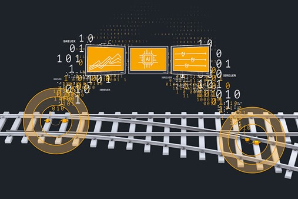
    <!-- <figcaption>Project Vision</figcaption> -->
</figure>

One of the main challenges is to clean and preprocess these noisy time-series data to obtain high-quality and reliable train signal data.

Based on these cleaned signal data it is then possible to provide AI-driven approaches to

- classify train types,
- track and predict train speeds and
- uncover potential anomalies.

These capabilities will enable us to provide valuable insights into the operation of the rail network and explore potential applications in areas such as

- real-time monitoring und control of rail traffic,
- predictive maintenance scheduling as well as
- enhanced security und surveillance.

We hope that our work contributes to the advancement of transportation systems und security, und provides a foundation for future research und development in this field.

## Sensor implementation

Our project integrates data from sensor units (BREUER ARTEMIS) already installed at 650 turnouts of Deutsche Bahn InfraGO AG, as well as a test installation at Brunswick dock railway in Germany.
This integrated dataset covers major lines in the InfraGO network, currently spanning across the middle and southwest regions.
Additionally, BREUER is preparing to expand the coverage to include the "Riedbahn" region.
The platform also supports data from all speed ranges (40-280 km/h) and various train categories, including Long-Distance, Regional, and Freight trains.

<figure markdown="span" style="display: initial;">
    <span style="display: block; margin: 0 auto;">
    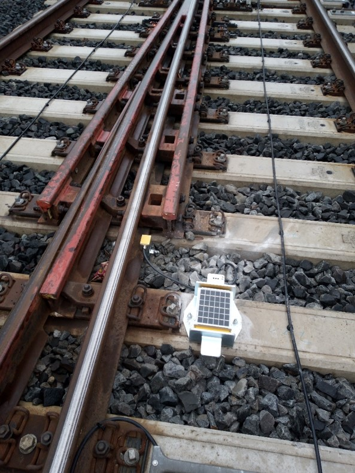{width=250 style=display:initial;vertical-align:middle;}
    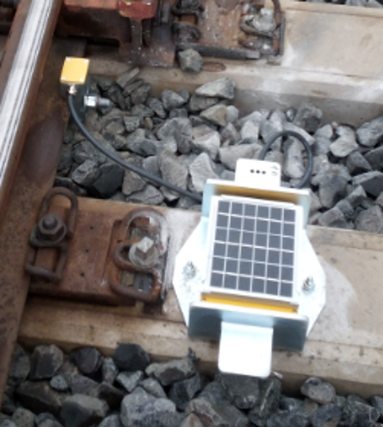{width=250 style=display:initial;vertical-align:middle;}
    <figcaption>Acceleration sensor at train switches</figcaption>
    </span>
</figure>

## Data

Breuer has made the data available to us through a website, from which we were able to download it in HDF5 format.
It concerns sensor data from turnouts on the DB network.
Each turnout has two sensors, called "Frog" and "Points", which measure vibrations of the rails at specific points in front of, behind or above the turnout in x, y, z directions.

The HDF5 files all follow the same data structure, as illustrated by the diagram below.

Each file includes precisely two distinct datasets, distinguished by their unique <span style="color:green">sensor identifiers</span>.
One sensor contains the `frog` data and the other the `points` data.
To distinction between these two sensors, it is necessary to check the value of the `placement` attribute within the sensors group.
Under each sensor are the sensor data labelled with a  <span style="color:blue">timestamp</span> in the format `2024-05-16T09:31:37Z`.

The `switch_list_info` also includes a timestamp, which appears to be consistently fixed at <span style="color:orange">19700101</span>.
It's possible that this may be an error, which could be fix in future updates by Breuer.

This repository mainly uses the <span style="color:red">su_acceleration_data</span> data.

<figure markdown="span">
    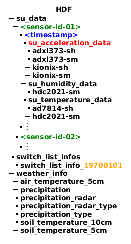
    <figcaption>HDF5 database structure overview</figcaption>
</figure>

/// details | HDF5 database structure including their attributes

Each HDF5 database path (groups as well as leaves) can contain attributes.
The following diagram illustrates each path including their available attributes.

<figure markdown="span">
    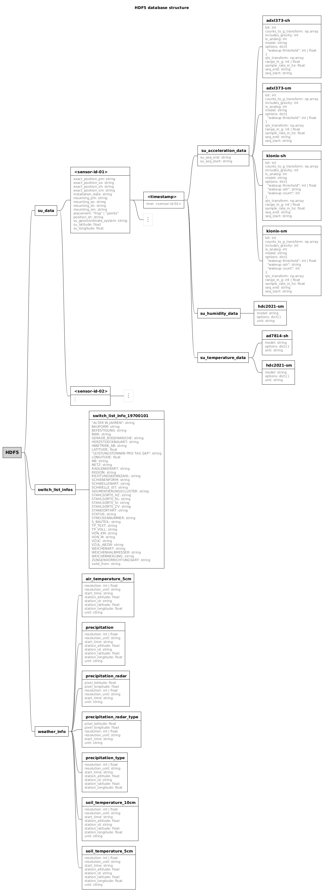
    <figcaption>HDF5 database structure including their attributes</figcaption>
</figure>

///

/// details | HDF5 database structure including attribute example data

Below is an excerpt of the HDF5 file structure, which includes example data for each attribute.
The actual values are taken from a single example file and for demonstration purposes only.

<figure markdown="span">
    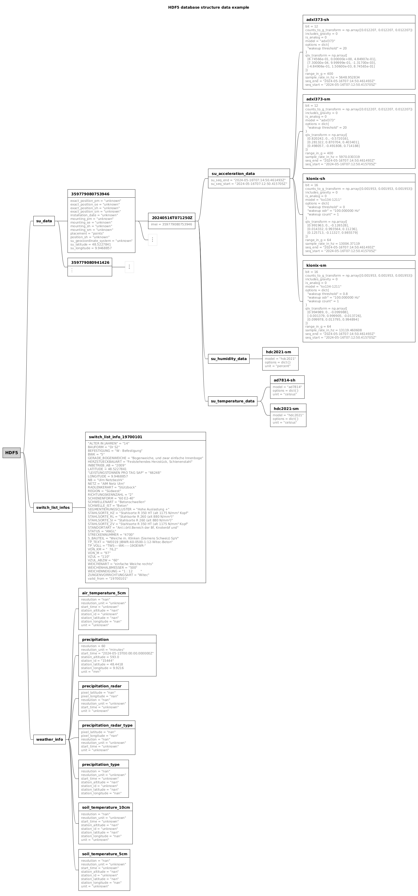
    <figcaption>HDF5 database structure including attribute example data</figcaption>
</figure>

///

## Signal Processing

The SLKI pipeline provides a range of signal processing methods, collectively referred to as stages:

- noise reduction
- signal extraction
- resampling
- outlier reduction
- signal smoothing
- normalization
- double integration
- ...

### Extract signal from data

A basic example of extracting a train signal from the data involves utilizing the stages _noise reduction_ and _signal extraction_:

<figure markdown="span">
    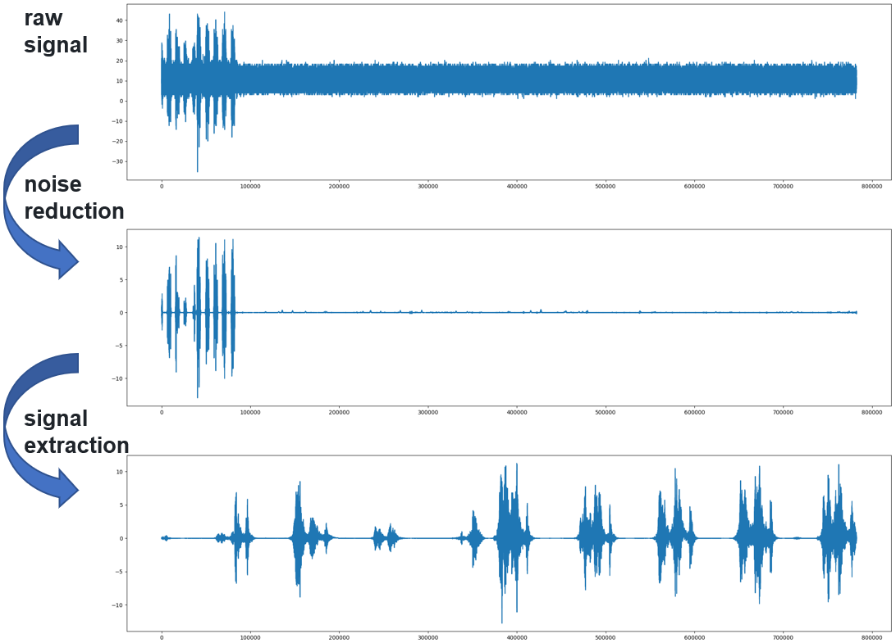
    <figcaption>SLKI pipeline basic example</figcaption>
</figure>

### Signal peak detection

Using [DBSCAN](https://scikit-learn.org/stable/modules/clustering.html#dbscan), it is possible to cluster the train signal and focus on the parts where the wheels actually roll over the rail. This method helps analyze the length and speed of the train itself.

<figure markdown="span">
    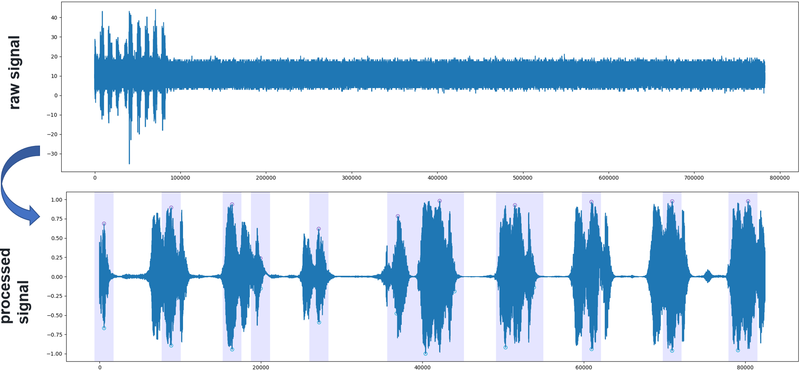
    <figcaption>SLKI peak detection example</figcaption>
</figure>

### Signal outlier detection

The idea behind detecting outliers involves:

- identifying all peaks in the signal
- calculating a boxplot of the whole signal
- using the boxplot's "minimum" and "maximum" as boundaries  
    $\Rightarrow$ fliers are anomalies or outliers
- using the fliers to boundary distance as importance factor

<figure markdown="span" style="text-align: initial;">
    ```{style=text-align:initial;}
        Q1-1.5IQR   Q1   median  Q3   Q3+1.5IQR
                    |-----:-----|
    o      |--------|     :     |--------|    o  o
                    |-----:-----|
    flier  min      <----------->       max   fliers
                        IQR
    ```
    <figcaption style="text-align: center;">Boxplot definition</figcaption>
</figure>

<figure markdown="span">
    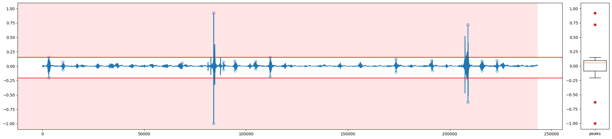
    <figcaption>SLKI outlier detection example</figcaption>
</figure>

### Train signal classification

Following multiple approaches to classify train signals into three major classes _Regionalverkehr_, _Fernverkehr_ and _Güterverker_, we examined various traditional machine learning algorithms, as well as time-series specialized frameworks like McFly [[Paper]](https://doi.org/10.1016/j.softx.2020.100548) [[GitHub]](https://github.com/NLeSC/mcfly).
In the end, we obtained the best results using a simple [ResNet](https://arxiv.org/abs/1512.03385) in combination with the time-series framework tsai [[Doc]](https://timeseriesai.github.io/tsai/) [[GitHub]](https://github.com/timeseriesAI/tsai).

The dataset consists of 3119 samples per category, which were split into balanced training (60%), validation (30%), and testing sets (10%).

The ResNet model achieved an accuracy of 89.2% after being trained for 20 epochs.

<figure markdown="span">
    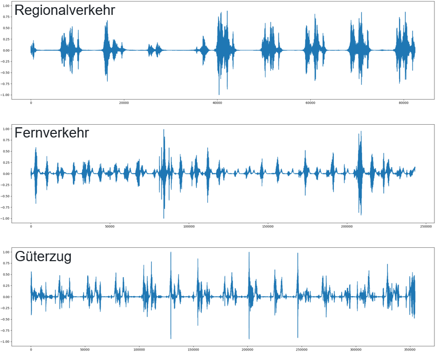
    <figcaption>SLKI signal classification: random samples</figcaption>
</figure>

<figure markdown="span" style="display: initial;">
    <span style="display: block; margin: 0 auto;">
    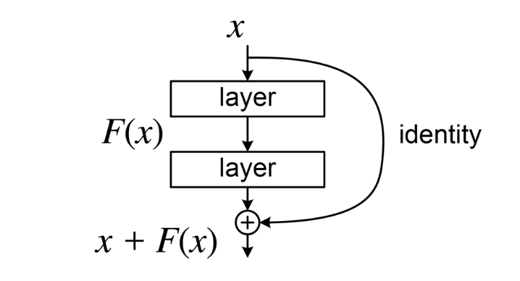{width=250 style=display:initial;vertical-align:middle;}
    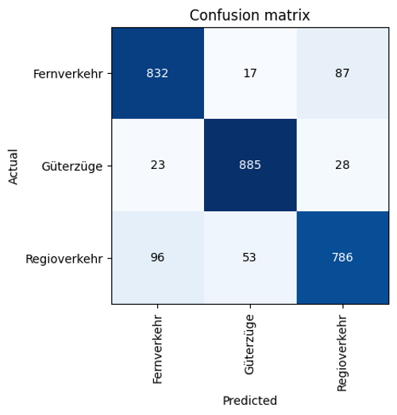{width=300 style=display:initial;vertical-align:middle;}
    <figcaption>SLKI signal classification: ResNet and confusion matrix</figcaption>
    </span>
</figure>
<!--
IMPORTANT
The ResNet image was taken from the Internet.
source: https://en.wikipedia.org/wiki/Residual_neural_network#/media/File:ResBlock.png
license: CC BY-SA 4.0
-->
